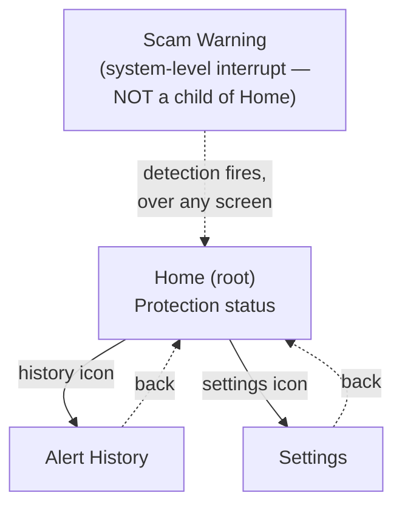
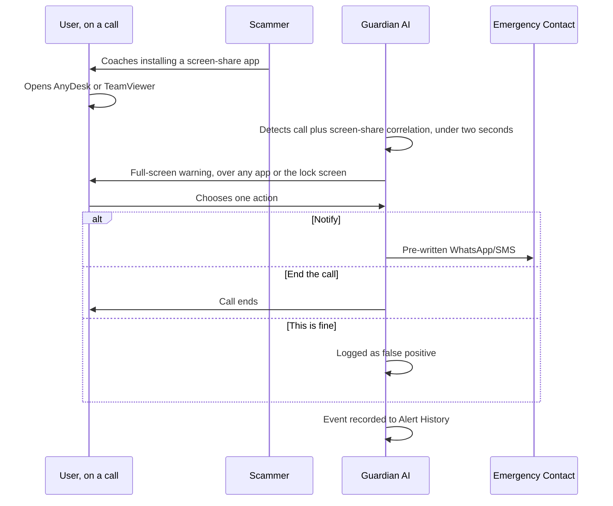
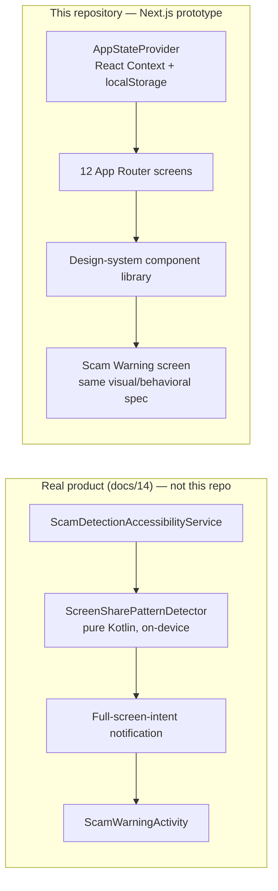

# Guardian AI: Cutting a Platform to Its One Defensible Wedge

### A product case study: from an 11-phase financial-safety platform to a frozen, one-engineer MVP, to a publicly demoable web prototype

*Every claim in this document is sourced from this project's own frozen
specifications (`docs/12`–`15`), its operating manual (`CLAUDE.md`), and
its complete build history (`docs/reports/`). Where the underlying
primary research (market sizing, full persona files, competitive
teardown) lives in an earlier phase of this project that predates this
repository and isn't reproduced here, this document says so explicitly
rather than filling the gap with invention. No metric, user count, or
research finding below is fabricated.*

---

## 1. Executive Summary

Guardian AI began as an 11-phase, cross-institution financial-safety
platform: bank-account linking, server-side fraud scoring, enforceable
payment holds, a full family "Trust Circle." An investment-committee
review found the platform's core weakness: it was building trust
infrastructure before proving the one moment that actually mattered.
That review triggered a deliberate strategic refactor, documented,
reasoned, and preserved rather than discarded, down to a single
wedge: **detect a live phone call plus a screen-sharing app opening,
warn the victim in plain language, and let them notify someone they
trust with one tap.** Everything else was cut to roughly 15–20% of the
original engineering scope and deferred to a V2/V3 roadmap.

This repository is the next link in that story: a Next.js web prototype
that rebuilds the frozen MVP's entire 11-screen experience for the
browser, plus a guided, interactive simulation of the product's core
moment, so the idea can be demoed to anyone without an Android device.
It is **not** the production Android app: every Android-only capability
in it is an honestly labeled simulation, never presented as more than
it is.

---

## 2. Background

The original vision (Phases 1–11 of an earlier planning effort, referred
to throughout `docs/12` as the "Product Strategy," "Market Research,"
"PRD," "Architecture," "Database," "API," "AI Design," "UX," "Design
System," and "Design Review" phases) specified a ten-feature platform
across three business channels: Account Aggregator bank-linking,
server-side transaction risk scoring, "Guardian Pay" enforceable holds,
a multi-role family Trust Circle, and a Fraud Timeline, among others.
That full body of work, and the Design Review that stress-tested it,
lives in a companion set of documents (referenced in `docs/12` as
`docs/00`–`11a`) that predate this repository and are not reproduced
here; this case study works from `docs/12`'s own summary and disposition
of that work, not the underlying documents themselves.

An investment-committee review found the platform's core pain was
**"severe-but-rare"** with **bimodal urgency**: "near-zero when you'd
sell it, extreme when it matters," meaning a broad platform asking for
bank-account linking and subscriptions before proving the one moment
that mattered was building trust infrastructure the product hadn't
earned yet. `docs/12` is the strategic response to that finding: a
document-by-document disposition of every prior artifact (kept, modified,
simplified, or deferred) and a full re-scoping down to a single
6–8-week, one-engineer MVP.

---

## 3. Problem Statement

A scam call coaches an independent, digitally active senior into
installing a remote-access app (AnyDesk, TeamViewer, and similar tools
are named explicitly in `docs/14` §10 as the India-targeted pattern this
detects) mid-call, then uses that access to move money or compromise the
device. The dangerous window is narrow: a live call, a screen-sharing
app opening, and then it's too late. No generic security or caller-ID
product watches for that specific, live correlation in real time.

## 4. Why This Problem Matters

`docs/12` frames the urgency as structurally bimodal: the moment doesn't
matter at all until the instant it matters completely, which is exactly
the shape of risk that's hardest to sell against and easiest to
under-invest in. The chosen persona (an independent, digitally active
senior, see §7) is deliberately *not* someone assumed to be
technologically helpless; the product's whole design language (see §19)
is built around respecting that.

## 5. Market Context

`docs/12`'s Market Research disposition re-weights the competitive
landscape specifically for this narrower wedge: **Google's on-device
scam-call pilot and Truecaller become the primary comparables** (not
EverSafe/Carefull, which were the comparables for the original *broad
monitoring platform*, not this detection-specific product). Background
fraud-statistics grounding (UPI fraud data, the RBI regulatory
landscape) is referenced as reusable context inherited from the earlier
market research phase, but the specific figures underlying it are not
reproduced in this repository's documentation: this case study does not
restate numbers it cannot verify against a source file it actually has.

## 6. Research Process

The foundational research behind Guardian AI, including problem
validation, persona development, JTBD synthesis, and the initial
competitive scan, was conducted in an earlier phase of this project
(`docs/12`'s "Phase 1"/"Phase 2" references) and lives in the companion
document set noted in §2, outside this repository. What *is* fully
documented here is the second research act: the investment-committee
review of the original platform, and the systematic, document-by-document
re-validation of every prior decision against that feedback (`docs/12`
§2's full disposition table). That's arguably the more instructive
process for a case study audience, since it's a rare on-the-record
example of scoping a product *down* with the same rigor most teams
reserve for scoping up.

## 7. User Personas

| Persona | Role in MVP | Disposition |
|---|---|---|
| **Ramesh (S2)** | Primary, near-exclusive persona | "His story *is* the MVP's core scenario, essentially unchanged" from the original platform design |
| **Anjali (S1)** | Secondary | Shifts from co-reviewer/app-user (in the original platform) to a notified contact who "may never open the app at all" |
| **Deepika (S4)** | Out of scope | Drops out entirely, deferred to V3 with the household segment |

The full persona files (demographics, tech comfort, day-in-the-life
detail) live in the earlier, unavailable phase referenced in §6. What's
directly verifiable from this repository's own docs: Ramesh is
characterized as an "independent, digitally-active" older adult (not a
technologically helpless stereotype) with a documented preference
against "unfamiliar iconography without support" (`docs/13` §11), a
detail specific enough to have directly shaped a real design rule (no
icon anywhere ships without a text label).

## 8. Jobs To Be Done

> **Ramesh (primary):** *"When I'm on a call that feels off, tell me
> it's a scam pattern before I do something I can't undo."*

> **Anjali (secondary):** *"When my parent might be getting scammed
> right now, tell me immediately, wherever I am, without me having to
> check anything myself."*

Both are quoted directly from `docs/12`'s Redefined MVP, tightened from
the original platform's broader "help me pause and get a second
opinion" framing to this specific, live-call moment.

## 9. Product Vision

> *"A trusted, autonomy-respecting second opinion standing between
> impulse or manipulation and irreversible loss."*

`docs/12` is explicit that the refactor doesn't change this destination.
It changes the order: prove the single moment that matters most,
on-device, for free, before asking anyone to link a bank account or pay
a subscription.

## 10. Product Principles

Five principles, carried forward unchanged from the original platform
because they mapped onto the narrower wedge at least as cleanly:

1. **Autonomy first**: the warning informs, never auto-acts.
2. **Never claim power the app doesn't have**: it cannot stop a call,
   only warn and help notify, and says so.
3. **Every warning comes with a reason**: never a bare risk score.
4. **Friction proportional to risk**: detection stays deliberately
   narrow rather than firing on vague suspicion.
5. **Evidence over blame**: a correctly dismissed false positive is
   still logged, never erased or treated as foolish.

## 11. Opportunity Sizing

**Not restated here, on purpose.** `docs/12` explicitly defers TAM/SAM/SOM
resizing to V2 business planning: "deferred to V2 business planning,
not redone here," rather than inventing a smaller-market figure to fit
the new scope. This case study follows the same discipline: no sizing
numbers appear here because none exist in this project's documentation
that this repository can verify.

## 12. Competitor Analysis Summary

| Comparable | Relevance to this MVP |
|---|---|
| **Google's on-device scam-call pilot** | Primary comp: closest in mechanism (on-device, real-time) |
| **Truecaller** | Primary comp: closest in distribution/brand category (caller-ID-adjacent safety) |
| **EverSafe, Carefull** | Comps for the *original, broader* monitoring platform, not this wedge; kept in `docs/12`'s record for context, not treated as competitors to the MVP |

## 13. Why Existing Solutions Fall Short

Two distinct gaps, both directly supported by `docs/12`'s own reasoning:

- **Generic caller-ID/security tools** (the Truecaller-adjacent
  category) aren't built to correlate a *live, in-progress* call with a
  *specific, real-time* foreground-app signal. They operate on
  known-number reputation, not in-the-moment behavioral correlation.
- **Broader financial-safety platforms** (the EverSafe/Carefull-adjacent
  category) require account-linking and trust infrastructure a new
  product hasn't earned yet, precisely the finding that triggered this
  refactor in the first place (§2).

## 14. Product Strategy

`docs/12` §1 names four reasons this specific feature, Scam Detection,
survived when nine others didn't, simultaneously:

1. The most painful, most urgent moment in the entire original
   ten-feature list.
2. Buildable without any external partnership (no Account Aggregator, no
   sponsor bank, no payment processor).
3. On-device *by requirement*, not by choice: call content never
   leaving the device was already a standing assumption (A25), so this
   feature was always architecturally independent of everything else.
4. The best possible demo the product has: "watch it catch a live
   scam call."

## 15. MVP Strategy

**Core value proposition** (`docs/12`, Redefined MVP §1): *"The moment a
live call is coaching you to share your screen or move money, Guardian
AI recognizes it and warns you in plain language before you act, and
lets you notify someone you trust with one tap."*

**Core user journey:** Install → grant call-screening/accessibility
permission → set one emergency contact → (time passes) → a scam-pattern
call happens → on-device detection fires within seconds → full-screen
plain-language warning → one-tap notify sends a pre-written WhatsApp/SMS
→ event logged to a simple history.

**Sprint plan** (`docs/12` §5, six-to-eight weeks, one engineer):

| Week | Focus |
|---|---|
| 1 | Android project setup; permission flow; first working detection heuristic |
| 2 | Detection refinement against real scam-adjacent apps; full-screen warning UI |
| 3 | Onboarding; local alert-history storage |
| 4 | One-tap Notify; minimal home status screen; settings |
| 5 | Minimal backend for event logging/analytics; internal testing, false-positive tuning |
| 6 | Closed beta with real seniors (founder's network); bug fixes; retuning |
| 7–8 | Play Store listing, demo video, soft launch, monitor accuracy/false-positive rate |

## 16. Prioritization Decisions

The single clearest artifact of this project's prioritization discipline
is `docs/12` §4's simplification table, a direct, quantified
before/after of the platform-to-MVP cut:

| Layer | Before | After (MVP) | Reduction |
|---|---|---|---|
| Services | 5 | 1 thin backend (or 0) | ~80–100% |
| API endpoints | ~20 | 4–5 | ~80% |
| Database tables | ~17 | 2–3 | ~85% |
| AI components | Classifier + rules engine + ML + feature store + LLM layer | On-device classifier only | ~90% |
| Screens | 26 | 5–6 | ~78% |

`docs/12`'s own blended estimate: **this MVP is roughly 15–20% of the
engineering effort of the full 11-phase design.**

## 17. Features Included

`docs/12`'s Must/Should-Have list, each item shipped as one of the 11
frozen screens (`docs/13` §3) and confirmed built in this repository's
own milestone history (`docs/reports/milestone-3`, `-5` reports):

- On-device screen-share/remote-access-during-call detection (simulated
  in this web prototype, see §23–24)
- Full-screen warning with plain-language explanation
- One emergency contact + one-tap notify
- Permission consent screen
- Basic alert history
- Accessibility settings, "protection is active" home status,
  edit/remove emergency contact (Should-Have, also built)

## 18. Features Explicitly Deferred

**Won't Have (MVP):** Account Aggregator, transaction risk scoring,
Guardian Pay, Fraud Timeline, Trust Circle roles/co-review, LLM
explanations, subscriptions, iOS.

**Could Have (not built):** a second detection pattern (fake-refund/
collect-request calls), 2–3 emergency contacts instead of one,
founder-facing analytics.

## 19. UX Philosophy

`docs/15`'s Design Philosophy, quoted directly: Guardian AI is
**"boring on purpose, and unmistakable exactly once."** Ten of eleven
screens are deliberately calm, muted, and quiet; the Scam Warning screen
is the only one allowed to look and feel different, and it earns that
contrast precisely because nothing else competes for it. Four visual
principles govern every screen: restraint as the brand (not a
constraint on it), one moment gets to be loud, clarity beats cleverness
always for this user, and the discipline that ties the whole product
together: **never look more capable than the app actually is.**

## 20. Accessibility Philosophy

Accessibility is the default experience, not a retrofit. `docs/15`:
*"There is no separate 'senior mode,' because the default *is* the
accessible mode."* Concretely: WCAG 2.1 AA contrast, 200% font scaling
without layout breakage, no interaction requiring more precision or
speed than a resting hand can manage, color never the sole carrier of
meaning, and read-aloud that's opt-in everywhere **except** the Scam
Warning screen, where it's automatic, the one deliberate exception,
justified by that screen's time-criticality alone.

## 21. Information Architecture

`docs/13` §1 is explicit that this is *not* a deep navigation
hierarchy, a single-purpose, mostly invisible background service with
three reachable surfaces, deliberately built without a tab bar:

*A four-tab bar would overstate the product's own daily relevance: one
thing matters (protection status), two surfaces are occasionally
visited.*

## 22. End-to-End User Journey

`docs/13` §5 Flow B, "the product's entire reason to exist":

## 23. Demo Experience

The real Android product's detection moment can't be reproduced in a
browser: there is no way for JavaScript to observe a live phone call or
a foreground app on the device. This repository's contribution is making
that moment *experienceable* anyway, honestly: Home → **Try Demo Mode**
→ **Start Demo** runs a guided, scripted call simulation (progressive,
skippable scammer dialogue) that ends the instant a simulated
screen-share app "opens," triggering a pixel-accurate implementation of
the real Scam Warning screen: instant appearance, no accidental
dismiss, automatic screen-reader announcement, haptic feedback where the
browser supports it, and the same asymmetric three-action stack the
frozen spec describes. Every exit action produces a real, persisted
Alert History entry, closing the loop back to Home. Nothing in this flow
claims to be real detection; every simulated moment is labeled as such
in the product copy itself.

## 24. Technical Architecture (High-Level)

Two architectures exist in this project's history, the specified
Android product and this repository's web reconstruction of its
experience:

The Android spec (`docs/14`) is a pragmatic three-layer architecture
(Presentation → thin Domain → Data) with **zero backend for MVP**: the
one component the entire product depends on,
`ScreenSharePatternDetector`, is pure Kotlin with no Android framework
dependency, specifically so it's unit-testable without an emulator. This
repository mirrors that "no backend" discipline in spirit: there is no
server, no database, and no API route anywhere in it. A single React
Context backed by `localStorage` stands in for the Android app's
Repository layer, and every Android-only capability (permission grants,
the call itself, the notify action) is an explicit frontend simulation.

## 25. Key Product Trade-offs

| Trade-off | Decision | Why |
|---|---|---|
| Backend vs. none | Backend-less V0 offered as "a legitimate, even leaner alternative" | `docs/12` §10: event logging isn't required for the product to function |
| Multiple detection patterns vs. one | One (Screen-Share Pattern only) | Friction-proportional-to-risk principle; a second pattern is explicitly Could-Have, V2 |
| Bypass Do Not Disturb vs. full-screen-intent only | Full-screen-intent only | `docs/14` Finding E-1: true DND override needs a third permission the frozen UX spec never asked for; the full-screen interrupt already satisfies the real requirement |
| Full-screen intent vs. heads-up fallback | Both, shipped together from day one | `docs/14` Finding E-2: Android 14+ restricts full-screen intent to an approved app category this product is adjacent to, not inside |
| This web repo: multi-scenario demo picker vs. one scripted scenario | One scripted scenario, with a skip-ahead control | An earlier presentation-layer plan proposed a scenario picker; later milestones judged it added UI surface without adding anything the frozen MVP needs |

## 26. Biggest Challenges

- **No browser automation tool was available in any session of this
  web prototype's build** (noted independently in the Milestone 3,
  Milestone 5, Milestone 6, and Release Candidate 1 reports). Every
  interactive, timing-, and state-dependent behavior had to be verified
  by manual code trace and `curl`-level inspection rather than a real
  click-through: a real, acknowledged limitation, not a hidden one.
- **That constraint still caught real bugs.** A manual trace in
  Milestone 5 found that the recorded outcome of a Scam Warning
  interaction didn't correctly prioritize "contact was notified" over
  how the screen was dismissed, contradicting the frozen data model's
  own enum semantics, found and fixed before it shipped, without ever
  running the app in a browser.
- **An accessibility finding traced back to the frozen spec itself, not
  the implementation.** Release Candidate 1 computed actual WCAG
  contrast ratios (not estimated) for every color pair in the design
  system and found one, `protectionOff` on `protectionOffContainer`,
  fails the 4.5:1 threshold at small text sizes. Because the color value
  is `docs/15`'s own specified hex code, it was documented for a human
  sign-off decision rather than silently changed, consistent with this
  project's standing rule that frozen-spec conflicts are surfaced, never
  quietly resolved.

## 27. Lessons Learned

- **Traceability compounds.** Nearly every component and screen in this
  repository's source code cites the exact `docs/12`–`15` section it
  implements. That discipline is what made a 4-phase, multi-session
  release-hardening process (Release Candidate → repository prep →
  deployment prep → this audit) possible without re-deriving context
  each time: every audit could grep for the claim and check it against
  a specific doc line, not against memory.
- **Auditing is not slower when it's incremental.** Each release-phase
  report (`release-candidate-1.md` through `github-release-audit.md`)
  re-ran the same core checks (dead code, secrets, format/lint/build)
  fresh rather than trusting the prior report, and each time, the
  result was "still clean," which is itself evidence the earlier work
  held up, not a wasted repeat.
- **"Do not fabricate" is a discipline that has to be applied to
  yourself, not just to the product.** The clearest example: rather than
  guessing a production domain for `sitemap.xml`/`robots.txt`, the
  correct fix was a standard environment-variable resolution pattern
  that defers the real answer to deploy time.

## 28. If Starting Again Today

Grounded only in what this project's own reports already flagged as open
work, not a new strategic pivot:

- **Build the manual QA checklist habit earlier, not just at Release
  Candidate 1.** A real browser pass at each milestone, not just a
  final checklist, would likely have caught the duplicate-`<h1>` and
  contrast findings sooner.
- **Resolve the `protectionOff` contrast question with product before
  building the screens that use it**, not after: the fix is trivial
  either way (a darker value, or a larger/bolder label), but it's a
  decision, and decisions are cheaper before three screens depend on the
  answer.
- **Generate the dedicated app icons (192×192/512×512) alongside the
  manifest**, rather than shipping a manifest that honestly discloses it
  doesn't have them.

## 29. Future Roadmap

**Product (`docs/12`'s own V2/V3 plan, unchanged by this repository):**
Account Aggregator bank-linking, server-side transaction risk scoring, a
second detection pattern, 2–3 emergency contacts, the full Trust Circle,
a Fraud Timeline, and Guardian Pay's enforceable transaction holds,
contingent on a sponsor-bank partnership.

**This web prototype specifically** (from `release-candidate-1.md` and
`milestone-5-report.md`): a richer guided-demo narrative (multiple
scripted scenarios sharing the identical underlying detection pattern,
an idea already scoped and deliberately deferred, not rejected), the
`protectionOff` contrast resolution (§26), dedicated app icons (§28),
and a full manual QA pass across real devices and viewport widths, the
one verification category no session of this project has been able to
complete itself.

## 30. Conclusion

`docs/12` closes with a question worth answering plainly here: is the
refactored MVP a stronger portfolio project than the original platform?
Its own answer is that neither piece alone is: the full platform never
had to survive contact with "would anyone actually pay for this, this
way, this fast," and the MVP alone is "a good first release, not an
impressive systems-design showcase on its own." **Together, presented
as a sequence, the actual story is this: the full platform, the
pressure-test that found its real weakness, the disciplined cut to the
smallest version that proves the core hypothesis, and now a public,
interactive prototype anyone can click through without an Android
device.** This repository is that sequence's most recent, most tangible
chapter.
